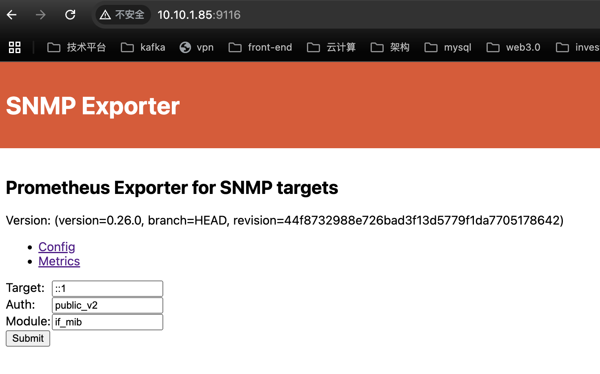

# 说明
这是指标汇总采集模块。

我们会在一台机器上部署 nccl-exporter、 snmp-exporter、 open-telemetry-collector，用于指标的汇总采集。
我们可以单独部署在一台节点上，也可以部署在已经运行了 exporter 的节点上。

注意 nccl-exporter、 snmp-exporter、 open-telemetry-collector， 在一个算网中 **只需要部署一份。**

> 为什么要使用  open-telemetry-collector 而不是 prometheus 直接来采集指标。是因为 prometheus 自身体系的采集方案扩展性不好，未来如果有“私有环境--中心端” 的架构需求，prometheus的 pushgateway 的方式会有性能问题。
而  open-telemetry-collector 同时兼具 push / pull 两种能力，也可以很方便的横向扩展。

# 前置条件
注意！如果没有安装 loki，请跳过这一步，并且注释掉 `docker-compose.yaml` 中 `nccl-exporter` 相关内容。还有 `gpu-server-collector.yaml` 中的 `job_name: mfu-exporter` 和 `job_name: nccl-exporter` 相关部分。

首先，我们要安装 nccl-exporter。请参考 [安装 nccl-exporter](https://github.com/xiaoxlm/nccl-exporter)

> 跳过 "docker 运行这一步"


# 修改 open-telemetry-collector 的配置
进入目录我们会发现一个 gpu-server-collector.yaml 文件。它是 opentelemetry 的配置文件。

在配置文件中的几乎已经全部配好，用户只需要在标有注释 `# 修改处`  的地方修改对应的值即可。

*注意配置中提到的 `kube-state-metrics-exporter`，如果有使用 k8s，请释放注释。*


# 启动 snmp-exporter 与 collector
在目录中，无需修改 `./docker-compose.yaml` 中的内容，直接启动:
```shell
$ docker-compose -f docker-compose.yaml up -d

 ✔ Container snmp-exporter   Started    0.4s
 ✔ Container otel-collector  Started    0.7s
```

## 验证 snmp-exporter 启动成功
snmp-exporter 比较特殊，需要我们用浏览器打开。比如我现在部署在 10.10.1.85 这台节点上，在浏览器中输入 10.10.1.85:9116。如果看到以下内容就表示 snmp-exporter 成功运行:


## 验证 opentelemetry-collector 启动成功
我们运行如下命令进行验证:
```shell
curl http://节点ip:8889/metrics
```
这是我们会看到控制台输出了很多指标信息。仔细看会发现就是采集5类指标: node-exporter, dcgm-exporter, nvidia-smi-exporter, snmp-exporter, kube-state-metrics-exporter
