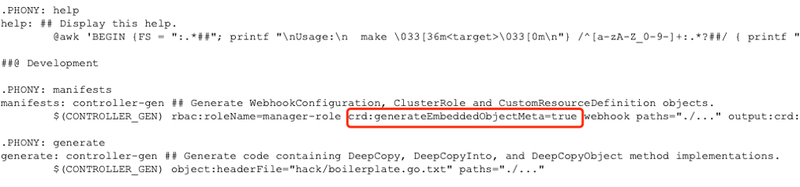

# 说明
在 k8s 上。我们可以使用 dlrover 进行分布式训练。详情参考 [dlrover](https://github.com/intelligent-machine-learning/dlrover)

# 部署 dlrover
1. clone dlrover
```shell
$ git clone https://github.com/intelligent-machine-learning/dlrover.git
```

2. 进入 CRD 目录，修改Makefile.
```shell
$ cd dlrover/dlrover/go/operator
```
然后修改 Makefile, 将 crd 替换为crd:generateEmbeddedObjectMeta=true 保存退出


3. 部署 crd
```shell
$ make deploy IMG=easydl/elasticjob-controller:master
```
如果遇到问题需要回退undeploy CRD：
```shell
$ make undeploy
```

> 没有安装 golang的，需要安装。如何安装 golang 这里就不展开了。

4. 权限配置
```shell
$ kubectl -n dlrover apply -f config/manifests/bases/default-role.yaml
```

5. 部署训练任务
- 添加 yaml 文件:
```shell
dlrover/dlrover/examples/pytorch/gpt2 ~# more elastic_job_gpu_sriov.yaml

apiVersion: elastic.iml.github.io/v1alpha1
kind: ElasticJob
metadata:
  name: gpt2
  namespace: dlrover
spec:
  distributionStrategy: AllreduceStrategy
  optimizeMode: single-job
  replicaSpecs:
    worker:
      replicas: 2
      template:
        metadata:
          annotations:
            k8s.v1.cni.cncf.io/networks: dlrover-hostdevice-network
        spec:
          # hostNetwork: true
          #dnsPolicy: ClusterFirstWithHostNet
          restartPolicy: Never
          volumes:
            - name: dshm
              emptyDir:
                medium: Memory
          containers:
            - name: main
              # yamllint disable-line rule:line-length
              image: lizdongkun/dlrover-gpu:gpt2-cuda11.8-distributed
              imagePullPolicy: IfNotPresent
              volumeMounts:
                - mountPath: /dev/shm
                  name: dshm
              command:
                - /bin/bash
                - -c
                - "dlrover-run --network-check --nnodes=2 --max_restarts=1 --nproc_per_node=1 /workspace/examples/pytorch/gpt2/train_gpt2_distributed_kun.py"
              securityContext:
                capabilities:
                  add: [ "IPC_LOCK" ]
              env:
                - name: HF_ENDPOINT
                  valueFrom:
                    configMapKeyRef:
                      name: hf-conn-cfg
                      key: HF_ENDPOINT
                - name: NCCL_DEBUG
                  valueFrom:
                    configMapKeyRef:
                      name: nccl-cfg
                      key: NCCL_DEBUG
              resources:
                limits:
                  cpu: "8"
                  memory: 16Gi
                  nvidia.com/gpu: 1 # optional
                  nvidia.com/hostdev: 1
                requests:
                  cpu: "4"
                  memory: 16Gi
                  nvidia.com/gpu: 1 # optional
                  nvidia.com/hostdev: 1
```
- 创建yaml里引用的两个configmap
```shell
$ kubectl create configmap hf-conn-cfg --from-literal=HF_ENDPOINT=https://hf-mirror.com -n dlrover
$ kubectl create configmap nccl-cfg --from-literal=NCCL_DEBUG=INFO -n dlrover
```

- apply yaml
```shell
$ kubectl apply -f elastic_job_gpu_dist.yaml
```

然后 kubectl get all -n dlrover -owide，正常情况下会看到 pod 进入 running 状态。 