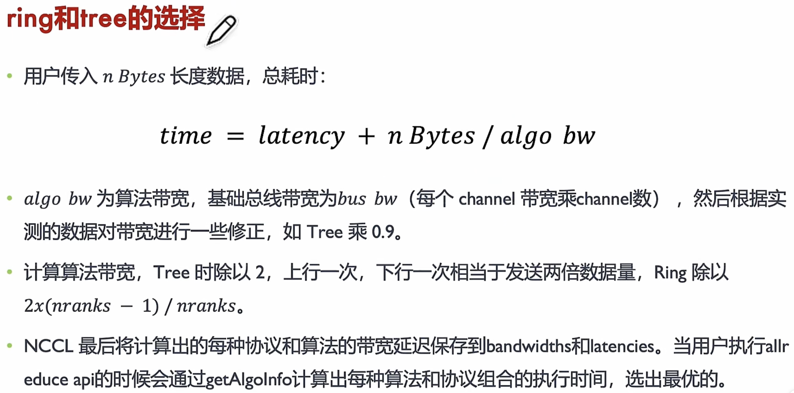

# 什么是 MPI
MPI(Message Passing Interface) 跨语言的通讯协议 or 范式标准，提供了应用程序接口 API，包括协议和通信语义，是一个库。是 XCCL 的实现基础。

MPI 标准规定了基于消息传递的并行编程 API 的调用规范和语义，不同的实现采用不同优化策略。

MPI 是基于 socket 或者 TCP/IP 之上去实现的。
# ring和tree的选择
